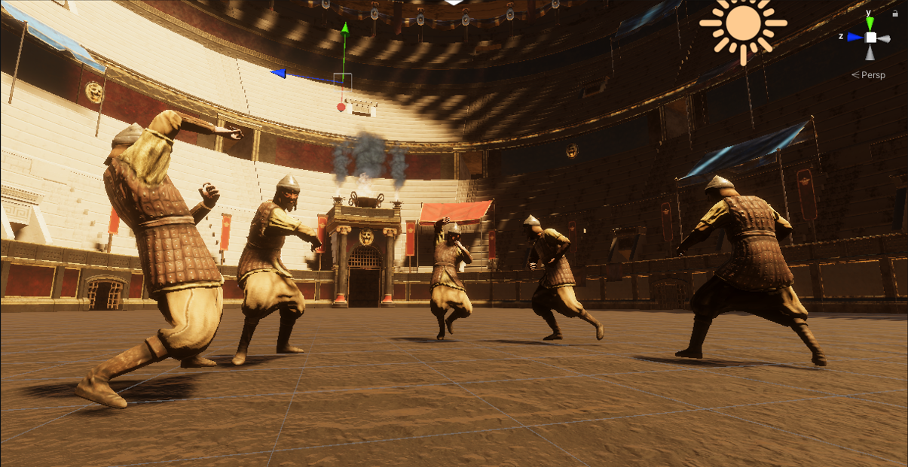

# Further Information

### Photos:

***
### Engine:
[Unity](http://www.unity.com)

***

### FAQ:

##### What engine are you using?

We are using [Unity](http://www.unity.com) engine.

##### Am I gonna be able to control the gladiators?

No, since this is supposed to be a gladiator management, you are not gonna be able to control any of the gladiators.
Altho you are going to be able to influence their decision making during combat.

##### Is there a permadeath mechanic in the game?

Yes, gladiators might die during combat and are therefore removed from the game.

##### Will gladiators be able to level and learn new skills?

Yes, your gladiators are going to become stronger the more battles they survive. 
The player will also be able to choose abilities for them.

##### Am I going to be able to choose any skill i want for my gladiators?

No, you are going to be able to choose one per level up. The skills you can choose from are going to be somewhat randomized.