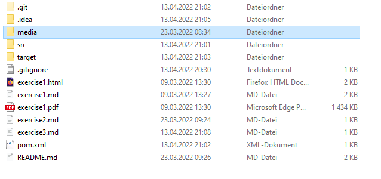
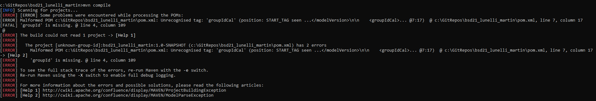
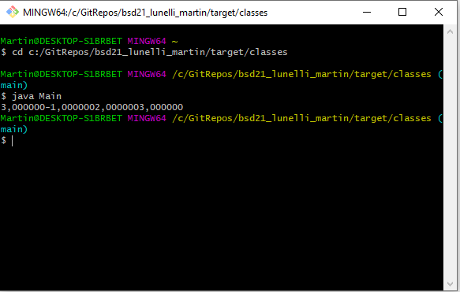

1. Install Maven
2. Create Maven Project in Intellij
3. Create exercise.md file
4. create documentation file
5. create classes
6. run

-"target" folder has been created automatically when running the program
-it includes the compiled class files

-got an error when compiling with "mvn compile":
-it includes the compiled class files

-could not finish the exercise, because the code to build the project that was given in the tutorial seems to be faulty.

-i ran the class file that was built by the IDE
