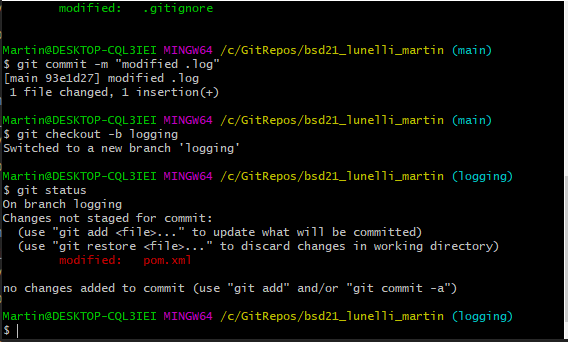
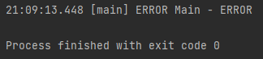
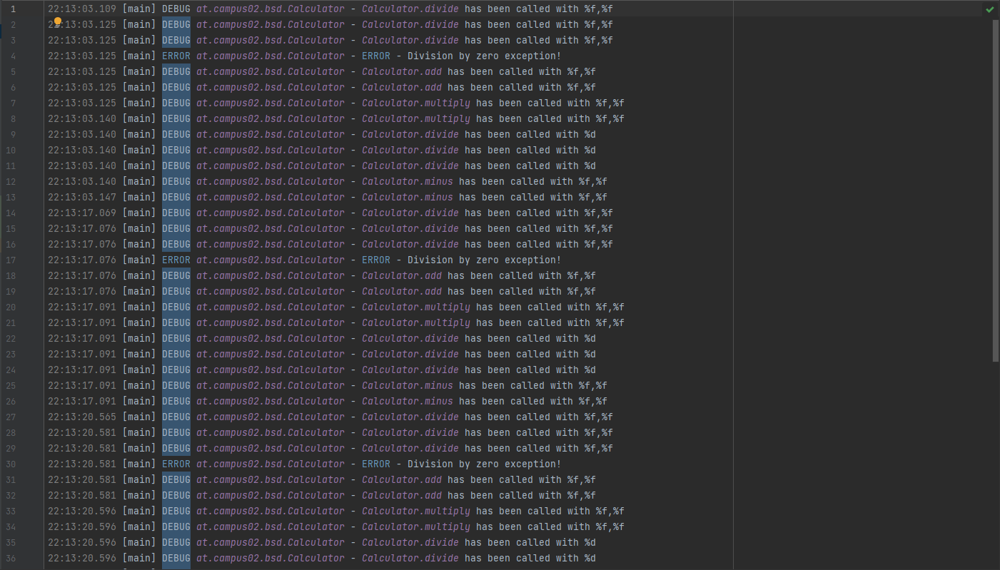
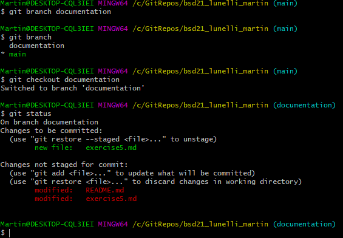

### Warum werden logging Bibliotheken verwendet?

Um eine Aufzeichnung über etwaige Fehler/Geschehnisse zu haben. Es entsteht ein Ereignisprotokoll.
Das erleichtert das Debuggen enorm. Logs sind besonders hilfreich, wenn man Fehler fixen muss,
welche bei einem anderen Benutzer auftreten, da man schließlich nicht dabei war,
und diese Fehler somit nicht LIVE mitverfolgen konnte.

### Welche Loglevel gibt es in LOG4J und was hat es damit auf sich?

Es gibt folgende Loglevel:
ALL < TRACE < DEBUG < INFO < WARN < ERROR < FATAL
Das Loglevel kann in der Konfigurationsdatei angegeben werden. Es definiert, welche Log-Nachrichten
relevant sind und welche nicht. Nachrichten des angegebenen Loglevel, sowie alle schwerwiegenderen, werden dann in die
Logdatei geschrieben.

###Was für Konfigurationsmöglichkeiten bietet Ihnen log4j?
- Einstellen des Loglevels
- Namen und Pfade der Logdateien
- Ausgabe in Logdateien oder Konsole
- Alte Logdatei weiterführen, oder überschreiben.
- Muster der Log-Nachrichten kann umkonfiguriert werden

Screenshots:

