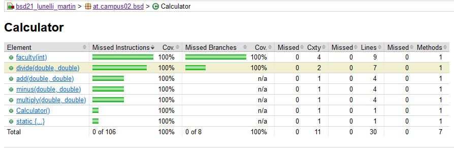

Was ist notwendig um Maven Site Dokumentation zu generieren?

dependencies in der pom.xml

Welche unterschiedlichen Aspekte, Konfigurationen, Informationen, usw.
werden in site.xml bzw. pom.xml konfiguriert?

dependencies

Images:

Leider war mir aufgrund der Anleitung nicht vollständig klar, was ich genau abbilden solltem habe es aber trotzdem versucht.

